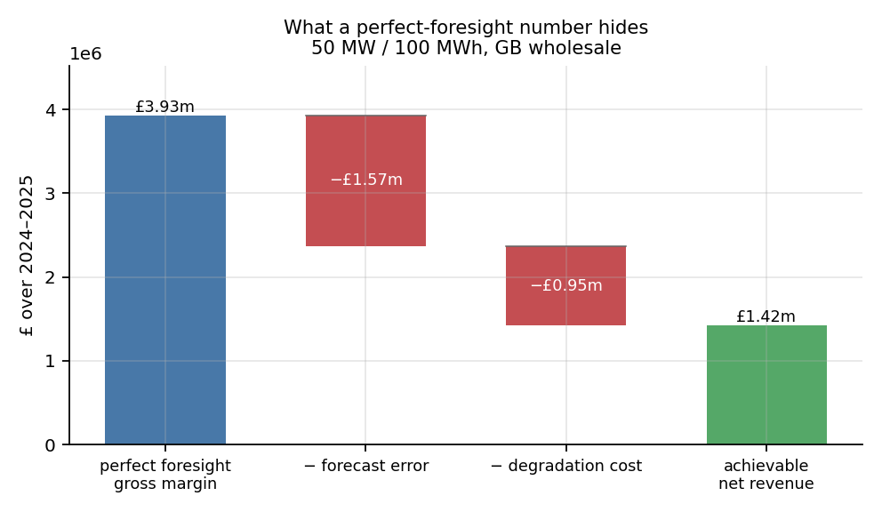
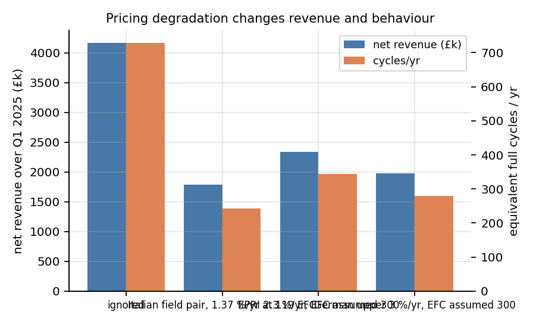
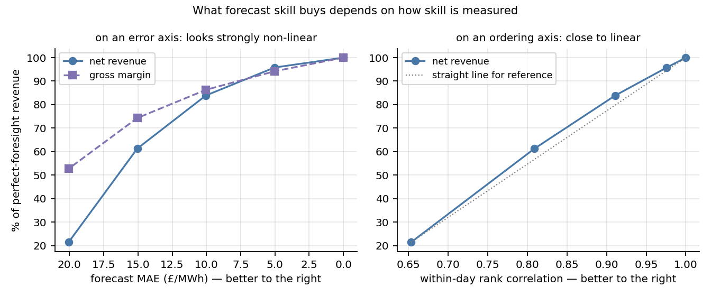
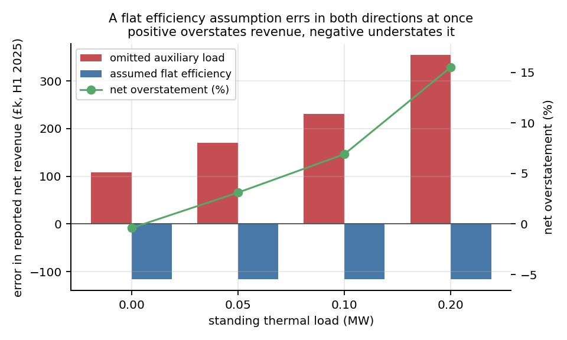
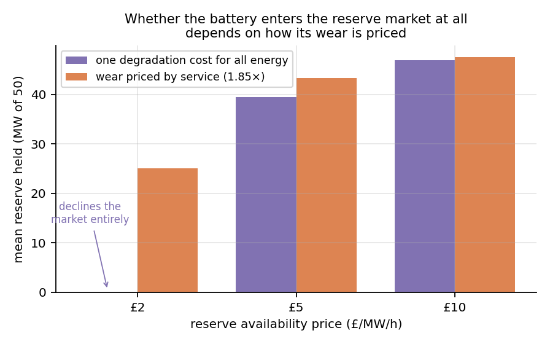

# BESS revenue stack — what four common modelling shortcuts cost, measured on GB market data

Grid-scale battery revenue models are easy to write and easy to get wrong in ways that do
not announce themselves: the model still solves, the schedule still looks reasonable, and
the revenue number is simply too high. This measures how much too high, one shortcut at a
time, on real GB market data — a 50 MW / 100 MWh battery on Elexon half-hourly prices,
March 2024 to January 2026, every finding on the same asset and the same window.

## The five results

| # | shortcut | what it costs | the catch |
|---|---|---|---|
| 1 | pricing wear at zero | overstates net revenue **42–78 %**, and implies 729 full cycles a year against 346–451 | the wear price is a four-input calculation and only one input is measured |
| 2 | no state-of-charge headroom for reserve | overstates **3–15 %** — at £2/MW/h it commits 40.1 MW of reserve against 26.5 MW it could deliver | reserve prices here are a synthetic sweep, not market data |
| 3 | assuming you can forecast | a real forecast captures **60 % of gross margin but only 48 % of net** | the gap is real but modest; it widens as the wear price rises, so it is a claim about degradation-aware models, not about forecasting |
| 4 | one flat round-trip efficiency | **the two errors inside it have opposite signs and mostly cancel** — with no thermal load the flat assumption is 2.9 % *low*, and what overstatement remains (to 5.7 %) is entirely the auxiliary load | the efficiency half is a **level** error, not a shape one: equalising the average leaves load-dependence worth 1.3 % of it. Tested at 1, 2 and 4 hours |
| 5 | one wear price for every service | shifts reserve holdings by **0.3–6.2 MW**, cuts cycling 5.8–8.6 % and raises net revenue 5.0–7.6 % | it does not change *whether* the asset enters the reserve market at this wear price; at a higher one it would |

Findings 1, 2, 4 and 5 compare two arms under perfect foresight, which is an unreachable
upper bound used because both arms share it. Finding 3 is the one that measures what
losing it costs.



Stacked together on the forecast-driven case: of £3.93m of perfect-foresight gross margin,
forecast error removes £1.57m and degradation cost removes a further £0.95m, leaving
£1.42m.

Two qualifications belong next to that number rather than deeper in the page. It describes
a **wholesale-only strategy indexed to the half-hourly reference price** — a real GB
battery also trades the day-ahead auction, where the clearing price is known at gate
closure and forecast error costs far less, so £1.42m is the achievable revenue of the
forecast-dependent leg, not of the asset. And the size of the gap is set by how wear is
priced: **2.8× at the field-anchored £12.1/MWh, 4.1× at the £20.2/MWh implied by the
German systems' eight-year record**. A factor of three to four, with the degradation price
as the dominant input, is the honest headline. The top bar is itself the gross margin of a
schedule that already prices degradation; a model ignoring wear entirely would cycle 729
times a year and print £4.17m.

This is a controlled experiment on one asset in one market, not a survey. The shortcuts
are shown to be *costly* here and shown to be *common* by citation — see How this relates
to published work, which also names the published paper that makes the same overall
argument, and records how an apparent disagreement with it on finding 4 dissolved into a
mislabelled term on this side.

## The five results in detail

Running every finding on one window is deliberate: shorter windows in this dataset have
wider spreads, so choosing a quarter per finding would let each effect be reported at its
most flattering. Doing the opposite turned out to strengthen the results rather than
soften them.

### How much of that is the sample

Every number above is a single point computed on one window of 672 execution days — 48
half-hours each, which is what the optimiser commits to before re-planning — and until now
nothing on this page said how much it would move on a different draw of them. A
moving-block bootstrap over execution days answers that without re-running the
optimiser: dispatch is solved once and the per-day results are resampled in 7-day blocks
(2,000 replicates, block length from the n^1/3 rule and one weekday/weekend cycle; a
28-day block as a check widens nothing materially — `results/v7_bootstrap.csv` carries
both). Reserve prices are parameters, not data, and are not resampled: the uncertainty
quoted is over market days at a fixed reserve price.

| headline | point | 95 % CI | quarterly range |
|---|---|---|---|
| degradation overstatement, field-anchored | 42.1 % | 37.6 – 46.8 | 32.2 – 76.4 |
| degradation overstatement, German record | 78.3 % | 69.0 – 89.2 | 59.9 – 155.2 |
| headroom overstatement at £2/MW/h | 14.0 % | 12.7 – 15.5 | 12.7 – 16.8 |
| net capture, LightGBM forecast | 48.4 % | 44.1 – 52.4 | 36.6 – 63.1 |
| conventional efficiency error, no thermal | −2.9 % | −3.7 – −2.2 | −4.3 – −1.7 |
| shape share of the efficiency term | 1.3 % | 1.2 – 1.3 | 1.1 – 1.4 |
| service-differentiation gain at £5/MW/h | 7.6 % | 7.0 – 8.3 | 6.5 – 10.2 |

Two readings matter more than the intervals themselves. None of the five findings is at
risk from sampling noise: **every interval keeps its sign**, and the tightest — the shape
share — is pinned to within a tenth of a point, which is what being level rather than
shape looks like under resampling. Signs are the honest claim to make here rather than
magnitudes: two of the headline *ranges* quoted above are narrower than their own
intervals — finding 2's interval reaches 15.9 % against a stated 3–15 %, and finding 5's
reaches 8.3 % against 5.0–7.6 % — because those ranges describe point estimates across a
sweep of reserve prices, not the uncertainty around any one of them.

But the quarterly column says these are window-averages over genuinely different
quarters, not constants of the market: the 42 % degradation overstatement was 76 % in the
31-day opening month of the window and 32 % a year later, and net capture ranged from
37 % to 63 % by quarter (`results/v7_quarters.csv`). Anyone carrying one of these numbers
to a different window should carry the quarterly range, not the point.

That second reading has a sharper form worth stating, because it decides which number to
quote. Drop the 31-day opening month and compare what is left — eight full quarters —
against the interval: **the seasonal spread is wider than the 95 % interval for every
quantity here, by 1.1× to 3.2×.** The bootstrap answers "how much would this move had the
same 22 months fallen differently", which is the narrower question; the quarters answer
"how much does it move from one season to the next", and the seasons win every time. So
the intervals above are a floor on the uncertainty rather than the whole of it, and two
consequences follow. Finding 1's headline range is not what it looks like: 42–78 % is two
*wear prices*, but a single wear price already moves 32–51 % across full quarters, so
season alone covers most of the width the assumption is being credited with. And finding 3
is the most seasonal result on this page in the sense that matters here — its quarterly
spread is 3.2 times its interval, the highest ratio in the table — which is what one would
expect of the only finding that depends on forecast quality, forecast quality not being
stationary. (In absolute width the widest interval belongs to finding 1 at the German wear
price, 20 points against capture rate's 8; the point is the ratio, not the size.)

**1. Ignoring degradation cost overstates arbitrage revenue by 42–78 % and implies
cycling no owner would accept.**

A degradation cost cannot be set from an annual loss rate alone: the same 2 %/yr means
a very different cost per MWh depending on how hard the asset was cycled to get there —
and, with sub-linear ageing, on how long the rate was observed. Only one public field
case reports the full triple — an Italian utility-scale plant, 356 equivalent full cycles
over three years to 95.9 % state of health, so 119 EFC/yr at 1.37 %/yr. The other field
cases enter as sensitivity under an assumed 300 EFC/yr, with their observation windows
carried where the source states one, and are labelled as such rather than as calibration.

**What "field-anchored" does and does not mean.** At the reference operating point the
cost reduces to a closed form in four inputs — replacement cost, discount factor, the
field loss-per-cycle pair, and usable depth — of which only the pair is a measurement.
The other three are conventions and the answer is sensitive to them: a discount rate
swept over 0–12 % moves c_deg from £30.44 to £7.81/MWh, replacement cost over
£80–160k/MWh from £8.06 to £16.12, assumed life over 8–15 years from £16.45 to £9.60. The
cell model supplies a response to depth, rate and temperature away from that reference
point, but every number published here is *at* the reference point, so none of them
exercises it. Anchoring pins the level to observed hardware; it does not turn c_deg into
a measured quantity.

£12.1/MWh still sits above published practice — industry convention is roughly £2–8/MWh
and Gale et al. (2026) use £0.50/MWh for a GB asset — but the difference is now a factor
of a few rather than the two orders of magnitude an earlier version of this model
produced. Part of the remaining gap is definitional: those are marginal-cost proxies,
whereas this is a replacement-cost amortisation over an observed field loss rate. A reader
whose prior is £5/MWh should know that findings 2 to 5 all run at £12.1, and that halving
it would move every magnitude here toward the smaller end.

| degradation assumption | c_deg (£/MWh) | net revenue (£) | £/MW/yr | cycles/yr |
|---|---|---|---|---|
| ignored, as in many public models | 0 | 4,169,625 | 45,295 | 729 |
| Italian field pair (1.37 %/yr at 119 EFC, 3 yr) | 12.1 | 2,934,034 | 31,873 | 451 |
| EPRI 2.3 %/yr — EFC and 3-yr duration assumed | 12.2 | 2,922,049 | 31,743 | 449 |
| German upper 3 %/yr over its 8-yr observation — EFC assumed | 20.2 | 2,338,253 | 25,401 | 346 |



729 equivalent full cycles per year is two a day, every day, for two years. Pricing the
wear cuts cycling by 38–53 % and removes 42–78 % of the revenue.

Two things about that table are easy to miss. The Italian and EPRI rows land within
pennies of each other despite headline loss rates of 1.37 and 2.3 %/yr — once the anchor
scales calendar and cycle ageing together, the published *rate* matters far less than it
appears to. What does matter, now that ageing is sub-linear, is the **observation
duration**: the German row is higher not because its rate is higher but because 3 %/yr
sustained for eight years is more damage than the model can produce in three, so the
anchor must scale it up. An earlier version used a three-year default for every row,
which understated the German case by a quarter.

**2. Omitting the state-of-charge headroom constraint overstates net revenue by
3–15 %, by selling reserve the battery could not have delivered.**

A battery paid an availability fee for reserve must hold enough energy to actually
deliver it:

```
SOC(t) − SOC_min ≥ R(t) · T_delivery      (deliver upward)
SOC_max − SOC(t) ≥ R(t) · T_delivery      (absorb downward)
```

Without these, the same stored energy is sold twice — once as arbitrage, once as
availability.

| reserve price (£/MW/h) | net with constraint | net without | overstated by | mean reserve held (MW) |
|---|---|---|---|---|
| 2 | 3,326,953 | 3,794,206 | 14.0 % | 26.5 → 40.1 |
| 5 | 5,036,219 | 5,779,780 | 14.8 % | 40.4 → 42.0 |
| 10 | 8,552,049 | 9,266,521 | 8.4 % | 45.8 → 44.4 |
| 20 | 16,203,677 | 16,681,857 | 3.0 % | 48.4 → 47.1 |

The clearest case is £2/MW/h, where the model without the constraint commits half as much
reserve again as it can back with energy — 40.1 MW against a deliverable 26.5 MW. The
revenue
error is largest at £2–5, where the battery must genuinely choose between markets, and at
£10–20 availability pays so well that both arms saturate; the two rows where
adding the constraint slightly *raises* mean reserve are a rescheduling effect, not a
solver artefact — the constrained problem shifts when it charges in order to keep
headroom, and ends up holding reserve in more periods at a lower average depth.

Two disclosures. **The reserve price here is a synthetic flat constant, not market data**
— £2/5/10/20 per MW/h swept, with £20 well above 2024–25 GB clearing levels and included
as a stress point. Only the energy prices are real. And this experiment's baseline already
prices reserve wear below arbitrage wear at the 1.85 ratio of finding 5, which is why it
holds 26.5 MW at £2 while the single-cost arm of finding 5 holds 20.3 MW at the same price.
The two tables are consistent; they are not the same baseline.

**3. A day-ahead forecast captures 60 % of perfect-foresight gross margin but only
48 % of net revenue — degradation cost amplifies forecast error rather than scaling
with it.**

| arm | forecast MAE (£/MWh) | gross margin | net revenue | net capture |
|---|---|---|---|---|
| perfect foresight | 0 | 3,932,212 | 2,930,400 | 100 % |
| LightGBM day-ahead | 20.1 | 2,365,021 (60.1 %) | 1,419,433 | 48.4 % |
| naive (yesterday, same period) | 21.2 | 2,128,241 (54.1 %) | 1,126,430 | 38.4 % |

The gap between the gross and net columns is the finding: a battery pays for its own wear
on every cycle whether or not the trade was profitable, so an imperfect forecast loses
margin twice, once in the trade and again in the wear spent chasing it.

**How big that gap is depends almost entirely on the wear price, which makes this a
weaker claim than it first appears.** At the field-anchored £12.1/MWh the gross-to-net
capture ratio is 1.24; at the German-record £20.2/MWh it is 1.54 (both computed, in
`results/v2_cdeg_band.csv`). An earlier, incorrect wear price of £30.6/MWh put it at 2.5,
which was dramatic and wrong. The mechanism is real and its direction is not in doubt,
but anyone quoting a magnitude has to quote the c_deg with it.



Cutting MAE by a quarter, from £20.1 to £15.1/MWh, lifts net capture from 48 % to 75 %.
On an error axis the transmission looks non-linear — and that reading does not survive
changing the axis.

The sweep is generated by blending the model's forecast toward the realised price, which
lowers MAE and injects oracle *ordering* at the same time. A battery earns on the
ordering. Both axes are therefore reported:

| | capture 48 → 75 % | 75 → 88 % | 88 → 97 % | 97 → 100 % |
|---|---|---|---|---|
| slope per £1/MWh of MAE removed | 5.2 | 2.7 | 1.7 | 0.6 |
| slope per unit of rank correlation | 167 | 134 | 132 | 133 |

The slope varies about ninefold on the error axis and 1.3-fold on the ordering axis — on
the axis a battery actually earns against, the relationship is close to a straight line.
**So the non-linearity is a property of the axis, not of forecasting**, and the
load-bearing result here is the gross-versus-net gap above, which needs no skill axis at
all. A sweep across forecasters of genuinely different *skill* would settle what real skill
improvement buys; it has not been run.

*Scope*: this applies to a strategy priced off the half-hourly reference price, which is
not known in advance. It does not apply to day-ahead auction arbitrage, where the clearing
price is known at gate closure and perfect foresight is close to achievable for that leg.
The forecast-dependent part of a real revenue stack is within-day and balancing.

### How much of the shortfall is the program, not the forecast

The capture number above is produced by a *deterministic* program: a single forecast path
handed to an LP that plans as though it were certain. Two different things are bundled in
the shortfall — the forecast not knowing the prices, and the optimiser not knowing that it
does not know. The second is a modelling choice, and `v8` removes it: five quantile
forecasts (q10–q90, LightGBM, same leakage discipline as `v2`) become a scenario set for a
two-stage program whose executed periods are decided once, before the uncertainty
resolves, with per-scenario recourse afterwards. A prediction was written down before
running it: with a risk-neutral linear objective the first-stage term collapses to the
mean forecast path, so any gain can come only through the recourse valuation of handed-over
state of charge, and should be small.

One bookkeeping note before the table, because the two capture numbers on this page are
not the same measurement. Finding 3's 48.4 % comes from `v2`'s point forecaster; the
53.6 % below comes from the q50 of an independently fitted quantile regression. Different
loss function, different fit, so the levels differ — 5.2 points of it. Everything in the
table is therefore read *within* `v8`, against `v8`'s own deterministic arm, and the
comparison that matters is between rows rather than against finding 3.

| arm | net (£) | net capture |
|---|---|---|
| perfect foresight | 2,930,400 | 100 % |
| deterministic, q50 path | 1,569,595 | 53.6 % |
| deterministic, mean of quantiles | 1,597,019 | 54.5 % |
| two-stage scenario, risk neutral | 1,599,174 | 54.6 % |
| two-stage scenario, CVaR(0.5) | 1,590,696 | 54.3 % |

It is small: **+0.07 points of capture**. On this scenario set, the architecture is
worth nothing measurable and the shortfall is the forecast — with two honest limits on how
far that reading goes. The quantile paths are comonotone (q10 is low in every period at
once), which understates the diversity of futures, so the recourse value measured here is
a lower bound; and the quantiles themselves are too narrow (empirical coverage 19 % at
nominal q10, 78 % at nominal q90, `results/v8_calibration.csv`), so the program was told
less uncertainty than there is. A scenario set with reshuffled *orderings* — residual
resampling, say — could still move the answer; it has not been built.

What the exercise did establish is the mechanism behind a throughput anomaly in finding 3:
the LightGBM arm cycles *less* than persistence, 425.5 against 450.8 EFC/yr
(`results/v2_capture_rate.csv`), despite forecasting better on every accuracy metric. A
battery does not earn the level of a price, it earns the spread, and a conditional mean —
or median — is a shrunk object by construction. Measured on the depth the marginal cycle
is actually priced against, the daily mean of the four highest prices minus the four
lowest (`results/v8_shrinkage.csv`):

| | mean daily spread | day-to-day sd | ratio of means | ratio of sds |
|---|---|---|---|---|
| realised | £64.84 | 56.56 | 1.00 | 1.00 |
| q50 forecast | £40.51 | 14.22 | **0.63** | **0.25** |
| persistence | £64.84 | 56.57 | 1.00 | 1.00 |

Persistence is the control that makes this readable. It is the *worse* forecast by MAE,
but it is an actual price path shifted by a day, so its width is right by construction —
and it comes out undistorted to three decimal places on both measures. The compression is
therefore a property of conditional-mean forecasting rather than of forecasting, which is
why the better forecaster is the one that under-cycles. A battery dispatched on a
flattened path sees fewer spreads worth its wear price.

That is the concrete argument for scenario-based dispatch, and it stands even though the
first scenario set tried here did not pay for itself — a set built from pointwise
quantiles inherits the same comonotone flatness rather than repairing it.

**4. The two errors hiding inside a flat efficiency assumption have opposite signs. For
a 2-hour battery they very nearly cancel, and everything that survives is the auxiliary
load.**

Loss has a load-independent part and a part growing with the square of current.
Calibrated to the *AC round-trip* efficiency of a utility-scale plant — measured AC
terminal to AC terminal at eleven power setpoints, so it excludes auxiliaries but
contains both power-electronic and cell losses:

| load | 5 % | 10 % | 25 % | 50 % | 75 % | 100 % |
|---|---|---|---|---|---|---|
| round-trip efficiency | 0.62 | 0.77 | 0.89 | 0.93 | 0.94 | 0.94 |

The important feature is that this curve **beats a flat 0.9 everywhere above about a
quarter load** — and a 2-hour battery discharges at 86 % of rated on average. Four arms,
each isolating one omission (the same March 2024 – January 2026 window, thermal load 0 to
0.2 MW):

| arm | net revenue (£) | |
|---|---|---|
| conventional: flat 0.9, no auxiliary draw | 2,934,034 | what a typical model prints |
| the same schedule, paying auxiliaries | 2,481,519–2,728,226 | costs £206k–£453k |
| the same schedule, also settled on the real curve | 2,774,620–3,021,326 | *gains* £293k back |
| optimised with the curve inside the program | 2,901,092–3,147,798 | a further 4.2–4.6 % |

| thermal load | 0 MW | 0.05 MW | 0.10 MW | 0.20 MW |
|---|---|---|---|---|
| conventional model overstated by | **−2.9 %** | −0.9 % | 1.2 % | 5.7 % |
| of which: auxiliary consumption | +£205,809 | +£267,485 | +£329,162 | +£452,515 |
| of which: the efficiency assumption | −£293,101 | −£293,101 | −£293,101 | −£293,101 |



With no standing thermal load the conventional model is 2.9 % *low*, not high: the
efficiency it gets wrong is wrong in the generous direction, and that gain slightly
exceeds the no-load draw it ignores. Every pound of net overstatement therefore traces
to the standing auxiliary load, and only at 0.10 MW of it does the conventional number
turn positive at all.

**That −£293,101 is almost entirely a calibration level rather than a curve shape, and
an earlier version of this section attributed it to the shape.** The two arms it
separates differ in two ways at once: one is flat and the other is load-dependent, but
they also do not agree on the average. Equalising the average settles which of the two is
doing the work. `v5` settles the one conventional schedule three times — under the flat
0.9025, under a *constant* round trip set to the curve's throughput-weighted equivalent
on that same schedule, and under the curve — with the same clipping rule and the same
auxiliary deductions in all three, so the loss model is the only thing that changes:

| | round trip | net revenue (£) | |
|---|---|---|---|
| flat, as the conventional arm assumes | 0.9025 | 2,728,226 | |
| flat, matched to the curve's throughput-weighted equivalent | 0.9640 | 3,017,556 | **level: +£289,330** |
| the load-dependent curve itself | — | 3,021,326 | **shape: +£3,771** |

The two terms sum to £293,101 exactly, so this decomposes the number above rather than
offering a second opinion about it. **Load-dependence accounts for 1.3 % of it.** The
rest is that a flat 0.9025 sits 6.15 points below what the curve actually delivers over
the load band this asset uses.

In hindsight it could hardly have been otherwise. With the schedule held fixed, energy
revenue is `Σ price × (discharge − charge)`, which does not reference the loss model at
all. The only channel through which an efficiency assumption can move revenue is
*clipping*: a model that stores energy more efficiently fills the battery sooner, so
charge instructions get cut back and less energy is bought. That is a level effect by
construction, and only what survives equalising the level can be about shape.

**The duration caveat this section used to carry has now been tested, and both halves of
it were wrong.** It said the result "holds for a 2-hour asset discharging at 86 % of
rated" and that "a longer-duration asset may flip it", on the reasoning that a longer
asset spreads the same energy over more hours and so sits lower on the curve. `v6` runs
1, 2 and 4 hours at fixed power:

| duration | mean discharge load | shape share of the efficiency term | conventional overstated by |
|---|---|---|---|
| 1 h | 83.2 % | 1.6 % | −3.1 % |
| 2 h | 85.6 % | 1.3 % | −2.9 % |
| 4 h | 96.6 % | 0.7 % | −3.0 % |

Discharge load *rises* with duration rather than falling, because the partial-power
period at the end of a discharge is a fixed cost per cycle whose weight in the average
shrinks as the cycle lengthens. The premise fails, and the conclusion with it: nothing
flips, the overstatement is flat to within 0.2 points across a fourfold change in
duration, and the shape term is if anything *smaller* for the longer asset. Pricing
degradation costs 44.4 / 42.1 / 42.0 % of net revenue at 1, 2 and 4 hours, so finding 1
is not duration-bound either.

Putting the curve inside the optimiser is worth 4.2–4.6 % and does shift dispatch, from
85.6 % to 89.5 % of rated discharge load, because an auxiliary-excluded curve rises
monotonically toward rated power rather than peaking mid-load. It survives the duration
sweep at 4.1 / 4.2 / 3.9 %.

**That 4.2 % carries the same confound, and splitting it is what reconciles this project
with Cornejo et al. (2025).** The comparison behind it pits a curve-aware program against
one that assumed a flat 0.9025 — so the program being beaten was mis-levelled as well as
shapeless. A third program, optimised on the matched constant and settled under the curve
like the other two:

| program | settled on the curve (£) | |
|---|---|---|
| flat 0.9025 | 3,021,326 | |
| flat, matched to the curve's equivalent | 3,134,669 | **level: +£113,343** |
| the curve itself | 3,147,798 | **shape: +£13,129** |

So of the 4.2 %, **89.6 % is not paying for load-dependence — it is paying for not having
mis-set a constant.** What load-dependence inside the optimiser is actually worth here is
£13,129, or **0.43 %** of the base. Cornejo et al. put the same quantity at **0.4 %** for a
fresh asset. The Status section below used to record that gap as "the calibration basis,
and it has not been reconciled experimentally"; the calibration basis was the right
hypothesis, and once the level is equalised the two figures agree to within a rounding
step. That is one comparison across different assets and markets, so it is agreement worth
noting rather than a validation — but it is no longer an open discrepancy.

Which efficiency figure is used decides this finding, so it is worth being explicit about
why it is the AC round trip and not the more quotable one. The same plant's better-known
pair — 85 % at full power falling to 65 % at low power — is its *global* efficiency, whose
denominator includes auxiliary energy. Calibrating to that while separately charging
thermal load and no-load loss would count auxiliaries twice. It would also misattribute
the droop: on that plant a full cycle takes 26.4 hours at 0.1 p.u. against 2.6 hours at
rated, so most of the 85→65 fall is a near-constant auxiliary draw integrated over ten
times the exposure — a time integral, not part-load electronics, and not something that
belongs in a power-indexed curve.

**5. Pricing wear by service is worth 5.0–7.6 % of net revenue and cuts cycling 5.8–8.6 %,
but at
this wear price it does not decide whether the battery enters the reserve market.**

Module tests under real grid duty profiles put peak-shifting ageing at 1.81–1.92×
frequency regulation at comparable throughput (Xu et al. 2025, 220 Ah LFP). The sign is
corroborated on a different chemistry and by a different measurement convention:
Ohrelius et al. cycled NMC532/graphite cells under five grid duty profiles and report "a
slower trend for FR and a faster rate for PS", attributing it to state-of-charge swing
amplitude rather than C-rate (2024), and the same group's lifetime study puts frequency
regulation at 12 years against 8 for peak shifting, a ratio near 1.5 (2023). No study
found during the literature check reports the opposite direction. Carrying that
distinction, rather than one degradation cost for all energy:

| reserve price (£/MW/h) | mean reserve held, one cost | with 1.85× ratio | cycling | net |
|---|---|---|---|---|
| 2 | 20.28 MW | 26.52 MW | −8.6 % | +6.8 % |
| 5 | 39.20 MW | 40.41 MW | −6.1 % | +7.6 % |
| 10 | 45.45 MW | 45.80 MW | −5.8 % | +5.0 % |



The effect is real but modest: reserve holdings rise 0.3–6.2 MW, cycling falls 6–9 %, net
revenue rises 5–8 %. The value comes less from holding more reserve than from doing the
same work with less wear charged against it.

**An earlier version of this finding claimed something stronger — that the distinction
decides whether the asset enters the reserve market at all — and that claim depended
entirely on an incorrect wear price.** At £30.6/MWh the single-cost model declined the
reserve market outright at £2/MW/h; at the corrected £12.1/MWh it holds 20.3 MW there.
Participation can still flip, but only when wear is expensive enough to make reserve
marginal under a single cost, so it is a statement about a parameter regime rather than
about the mechanism.

This finding also rests on the weakest assumption in the project, stated in the code:
mapping a capacity-loss ratio onto a marginal-cost ratio presumes damage accumulates
linearly with throughput, the approximation degradation physics is known to violate. Two
provenance caveats point the same way — the 220 Ah modules are second-life cells, and all
authors of that study are at one instrument manufacturer. The reserve price is the same
synthetic constant used in finding 2.

## What is different here

**Degradation is a power law, anchored to a field case, and charged at the margin.** Both
ageing terms in the cell model are power laws in their driver — calendar in time, cycling
in throughput — with exponents below one. Applying them matters more than any parameter
choice here: read as linear rates the same model predicts 67 % capacity loss over the
field plant's first three years against 4.1 % measured, and it was that apparent
sixteenfold over-prediction which made aggressive field anchoring look mandatory. With the
exponents applied the model lands within 20 % of a system it was never fitted to, so the
anchor is a 0.82 correction rather than a rescue.

The anchor scales calendar and cycle ageing *together* to reproduce the field plant's
measured loss over its own life — 356 equivalent full cycles across three years to 95.9 %
state of health. Charging that whole loss per cycle, as an earlier version did by dividing
a total loss by a cycle-only model term, prices calendar fade as though trading caused it.
It does not: a battery ages on the shelf, so calendar fade is a cost of ownership and only
the cycle term belongs in a cost per MWh.

Because the cycle exponent is below one, the marginal wear of one more cycle falls over
life — from about £15.4/MWh at 250 cumulative cycles to £10.0 at 3000 — and the £12.1 used
throughout is that curve at 1000 cycles, roughly mid-life for this asset. **The declining
shape is a convention, not a fact.** It prices the capacity each cycle consumes; the
equally defensible alternative, natural when end of life is a threshold, prices every
cycle as an equal share of the discounted replacement and is *constant*: £11.2/MWh here,
or £14.3 once calendar fade's share of the usable window is netted out of the cycle
budget. All three integrate to the same lifetime total, all three sit within a few pounds
of each other, and `results/v0_cdeg_inputs.csv` carries them side by side. The implied
cycle life of 4,740 to 80 % capacity is inside what large-format LFP is warranted for —
the sanity check that first exposed the missing exponents, since reading them as linear
rates implied 911.

**Auxiliary consumption is separated by where it actually arises, and kept out of the
efficiency curve.** The load-independent loss inside the AC round-trip curve (0.69 MW,
1.4 % of rated) is charged only in periods when the converter runs, gated by one binary
per period. Thermal management is the genuinely round-the-clock part, is modelled as
power times time rather than as an efficiency penalty, and is swept over 0–0.2 MW. That
range is an order of magnitude reasoned from the 1–3 % of throughput field data supports,
not a field anchor: the source plant never discloses its auxiliaries' nominal rating, so
an absolute standing draw cannot be taken from it. Keeping auxiliaries out of the
efficiency metric is what stops the same energy being charged twice.

**Degradation cost is differentiated by service.** Module tests on 220 Ah LFP under
real grid duty profiles put peak-shifting ageing at 1.81–1.92× frequency regulation
at equal throughput. That ratio is carried into the optimiser so that arbitrage and
reserve are not priced identically. The assumption this rests on — that damage is
proportional to throughput, i.e. linear accumulation — is exactly the approximation
degradation physics is known to violate, and is flagged in the code rather than
buried.

**No API keys, no manual downloads.** The Elexon Insights endpoints used here are
publicly reachable and need no key or registration (verified 2026-07-28); existing
Python wrappers for them are unmaintained, so the client is self-contained and caches to
parquet. One command reproduces every number above from nothing. No Elexon data is
redistributed here — the cache is git-ignored and each run fetches its own copy — and
Elexon's terms of use are not asserted in this repository; see NOTICE.

## How this relates to published work

This project is **not** the first to argue that modelling shortcuts inflate battery
revenue. That argument is published, and the closest paper states the thesis of this
repository almost exactly.

**Mohamed, Rigo-Mariani & Debusschere (2025)**, *Impact of modeling assumptions on the
economic performance assessment of a storage participating in energy and reserve
markets*, Journal of Energy Storage 133, 117998, doi:10.1016/j.est.2025.117998. Isolates
three simplifications — constant operating efficiency, neglected profit loss from
uncertainty, degradation computed after the fact — and reports up to 30 % overestimation
of lifetime profit, more than 60 % in the worst cases, on continental day-ahead plus FCR.
That paper also assesses its assumptions successively rather than only in aggregate, so
the decomposition itself is not what is new here. What differs is the shape of the
decomposition and, more usefully, a disagreement worth having: it assembles assumptions
cumulatively, so whichever enters first absorbs the largest share, whereas each assumption
here is isolated against a common baseline.

**An earlier version of this section claimed the two studies reach opposite conclusions on
the same question — that it identifies part-load efficiency as the largest error source
while finding 4 finds the flat-efficiency error nearly cancels. That claim does not
survive the decomposition in finding 4.** What this project measured under the heading of
part-load efficiency turned out to be 98.7 % a difference in the *average* efficiency of
the two arms
and 1.3 % load-dependence. Mohamed et al. are talking about the load-dependence. So the
two results were never about the same quantity, and there was no disagreement to have —
only a mislabelled term on this side. What can be said, much more weakly, is that carrying
load-dependence rather than a level-matched constant is worth £3,771 out of £2.9m here,
for a 2-hour asset that spends its time near rated power; that is a statement about this
asset and this calibration, and it is not evidence against a paper studying a different
asset in a different market. Two further dimensions enter here that it does not cover,
auxiliary load and forecast skill, and the market is GB wholesale rather than continental
day-ahead plus FCR. Anyone reading this repo as novel should read that paper first.

On the individual layers:

| published work | what it establishes | how this differs |
|---|---|---|
| Kumtepeli et al. (2024), ACC, doi:10.23919/ACC60939.2024.10644173 | depreciation cost is a poor proxy for revenue lost to ageing; profit 30–50 % below the best-parameterised case | measures the error in *reported revenue*, not the loss from a suboptimal dispatch rule |
| Jafari, Botterud & Sakti (2020), Applied Energy 276, 115417 | simplified battery representations overstate offshore wind-storage revenue by ~35 % | GB standalone asset on 2024–2025 data; overstatement split into attributable layers rather than one total |
| Falezza (2026), arXiv:2604.12082 | forecast skill maps non-linearly to revenue; Kendall τ, not MAE, is the decision-relevant axis; persistence captures 32.8 % of oracle | see the reconciliation below |
| Humiston, Cetin & de Queiroz (2026), Energies 19(4) 1056 | linear-calendar and energy-throughput ageing give ≈2 %/yr and modest economic impact; rainflow gives much higher loss, large negative valuation, and is highly sensitive to calibration | that calibration sensitivity is the failure mode field anchoring here is built to avoid; their design deliberately holds dispatch fixed, whereas dispatch response is the object of study here |
| Cornejo et al. (2025), ISGT Europe, doi:10.1109/ISGTEurope64741.2025.11305340 | putting a non-linear equivalent-circuit loss model inside an MPC is worth 0.4 / 1.9 / 3.8 % at internal-resistance multipliers of 1 / 2 / 3 | verified against the paper's own Figure 2 and Table II; SOH_R is an internal-resistance multiplier, so 1.0 is a fresh cell and 3.0 a second-life one. the fresh-asset figure is 0.4 %. That sat against 4.2–4.6 % here until the level and shape of the efficiency assumption were separated; on the level-matched comparison the figure here is 0.43 %, so the gap was the calibration basis and the two now agree (finding 4, and Status) |
| Gatta et al. (2015), IEEE PowerTech, doi:10.1109/PTC.2015.7232464 | auxiliary loads are "usually disregarded in studies concerning BESS integration" | supplies the prevalence evidence for finding 4 rather than asserting it |
| Schimpe et al. (2018), Applied Energy 210, 211–229 | 18 loss mechanisms in a container system; power-electronic losses exceed cell losses at low operating power | the mechanism behind the curve shape used here |
| Gale et al. (2026), J. Energy Storage 166, 122328 | GB balancing-market access is worth £166,123/MW/yr against £47,234/MW/yr for wholesale alone — but the first figure assumes unconstrained BM access, and the paper notes real batteries skip over 90 % of instructions and that a commercial GB battery earned £101k/MW/yr from all sources in 2023; revenue falls about £12,000/MW/yr per 10 points of skip rate | the sharpest disagreement in this table, and the best prevalence evidence for finding 1: it prices wear at £0.50/MWh and argues explicitly that "the insensitivity of results to our economic proxy for degradation lends support to not needing to model degradation" — a 2026, GB, open-access paper taking the exact shortcut finding 1 measures, at 1/24 of the cost used here. Its wholesale-only figure is also the closest published like-for-like revenue comparison, used as such below |
| Vykhodtsev et al. (2022), Renewable and Sustainable Energy Reviews 166, 112584 | taxonomy of battery models used in techno-economic analysis | classifies the modelling choices without quantifying what they cost, which is the gap addressed here |

**Reconciling finding 3 with Falezza (2026).** That paper reports near-complete capture
at high forecast skill; the LightGBM arm here captures 48 % of net revenue. The numbers
are not in conflict because they measure different assets in different markets: a
10 MW / 10 MWh unit across FCR, aFRR, day-ahead and intraday in DE/CH, where the reserve
capacity payments do not depend on a price forecast at all, against a 50 MW / 100 MWh
unit on GB wholesale alone, where every pound is forecast-dependent by construction. The
methodological point stands on its own merits, and this repo partly concedes it: `v2`
reports within-day rank correlation (0.58 persistence, 0.65 LightGBM) and direction
accuracy alongside MAE, precisely because MAE is a weak proxy for dispatch quality. The
skill axis in the transmission figure is still MAE, which is the honest limitation — a
τ-indexed sweep would be the better experiment and has not been run.

**On prevalence, and where the claim is weak.** Most of the table above prices
degradation, which is evidence *against* the composite baseline being universal. The one
unambiguous contemporary instance is Gale et al. (2026): same market, same year, open
access, wear priced at £0.50/MWh with an explicit argument that detailed degradation
modelling is unnecessary. Auxiliary omission has a clean source in Gatta et al., who
record that auxiliary loads are "usually disregarded". Beyond those, "common" rests on
Mohamed et al.'s opening characterisation and Vykhodtsev et al.'s taxonomy, not on a
census — so the claim is strongest for degradation and auxiliaries and weakest for the
composite baseline as a whole. Worth adding that Gale et al.'s own numbers do not fully
support their insensitivity claim: raising their proxy from £0.50 to £5/MWh costs about
£25,000/MW/yr, roughly 15 % of their headline stack.

**What the literature check did not settle.** Body text could not be reached for Gatta
et al. (2015) or for the published Jafari et al. (2020) — the 35 % figure comes from the
publisher abstract, and the widely-cited 155 % in the preprint version compares gross
revenue under one model against net revenue under another, a base mismatch the paper
itself concedes reduces to 29 % when made consistent. That is the same error this project
made in an early version of `v0`, which is why it is spelled out rather than cited
silently.

## Does any of this land near the real market?

A model that says a GB battery earns £4k/MW/yr when published indices say £73k is either
measuring something narrower or is wrong, and the difference has to be accounted for
rather than asserted. Every figure here is normalised to £/MW/yr for the same
50 MW / 100 MWh asset.

| | £/MW/yr | scope |
|---|---|---|
| this project, degradation ignored, perfect foresight | 45,295 | wholesale arbitrage only |
| **Gale et al. (2026), modelled, wholesale only, 100 MW / 1 h, June 2020 – June 2023** | **47,234** | wholesale arbitrage only, marginal cost £0.5/MWh |
| this project, field-anchored degradation, perfect foresight | 31,873 | wholesale arbitrage only |
| this project, degradation + out-of-sample forecast | 15,442 | wholesale arbitrage only |
| Modo Energy, realised, typical 2 h GB BESS, 12 months to Apr 2026 — wholesale + balancing only | 43,829 | 60 % of that fleet's stack |
| Modo Energy, same asset and period, **full stack** | 73,145 | + Capacity Market (7,454) + ancillary (21,862, i.e. 29.9 % of the full stack) |
| Gale et al. citing Modo: a real commercial GB battery, all sources, Jan–Aug 2023 | ~101,000 | full stack |

The top line is the closest like-for-like comparison: wholesale arbitrage, before
degradation is priced, on a perfect-foresight schedule, over the full window. At £45.3k
against £47.2k the two land within 4.3 % — but that agreement should not be leaned on,
because one adjustment is known and unapplied. Gale et al. model a one-hour asset and
state that doubling energy capacity raises revenue by about 30 %, which puts their figure
nearer £61k on a two-hour basis; on that correction this project sits about a quarter
below them, on a different three-year window that included the 2022 price crisis. The
honest reading is *the same order of magnitude, with the duration correction unresolved*.

**What the comparison does establish is that the apparent order-of-magnitude discrepancy
against full-stack indices is not a modelling error.** It is the deductions this project
measures plus the markets it excludes. Reading down the table: pricing wear at the
field-anchored £12.09/MWh cuts the figure by 30 %, and replacing foresight with a real
out-of-sample forecast removes half of what is left. Neither step is present in any
published index.

What is excluded is as important. This asset trades one price series. It does not touch
the Balancing Mechanism, holds no ancillary contracts, and earns no Capacity Market
derating payment — the last of which alone is £7,454/MW/yr in the Modo breakdown.
Consistent with that, `v1` shows a single reserve stream at £5–10/MW/h lifting net revenue
to £55k–£93k/MW/yr, which brackets the £73k full-stack benchmark.

Two limits on how far this can be pushed. Modo's index methodology sits behind a login,
so whether it is gross or net of degradation cannot be established — it therefore cannot
validate the degradation layer specifically, only the gross arbitrage layer. And no
published GB *capture rate* exists to compare against: Modo publishes the definition
(revenue divided by a theoretical maximum from real-time top-bottom spreads) and ERCOT
values ranging 38 % in January 2025 to 85 % in May, but no GB series. Modo's own GB
forecast note concedes that "the reality is quite different to a 24-hour perfect foresight
model" without quantifying the gap, which is the gap `v2` measures.

Two widely-repeated figures were checked and are **not** used here, because tracing them
found no source. A claim that GB batteries captured "44 % of available EET, up from 36 %"
resolves, on Modo's actual page, to 49 % (and 70 % versus 32 % by duration) — and refers
to the Embedded Export Tariff across three Triad half-hours, far too narrow to represent
annual capture. A claim that perfect foresight overstates arbitrage revenue by only
10–15 % appears in search-engine summaries attributed to two papers, neither of which
contains the number or concerns GB. Both appear to be artefacts of AI-generated search
summaries.

## Verification

`scripts/verify.py` asserts the invariants that a plausible-looking model can still
violate. Every check exists because something went wrong once:

- state of charge is the exact integral of what crossed the terminals, under both the
  flat and the load-dependent loss model
- reserve is always deliverable when the headroom constraint is on, and demonstrably
  undeliverable when it is off, so the experiment measures what it claims to
- the tangent representation of converter loss reproduces the analytic curve to 0.01 %
  of rated power
- field anchoring reproduces the degradation rate it targets, to machine precision
- no forecast feature at time t responds to a price at t or later, verified by
  perturbing a future price and confirming that no earlier feature row moves

Three properties of the suite are worth naming because they are uncommon. The headroom
check is bidirectional: it asserts not only that reserve is deliverable when the constraint
is on, but that it is *demonstrably undeliverable* when the constraint is off — otherwise
the experiment might be measuring nothing. The degradation checks assert the closed
form the cost reduces to, which is what catches a scaling factor silently cancelling the
model it is meant to scale. And the level/shape split is checked as an *identity* — level
plus shape must equal the curve term `v3` reports, and the split's two endpoints must be
`v3`'s own arms rather than merely resemble them, since the sum could stay right while
both ends drifted onto a different quantity.

The rolling-horizon path that produces the headline numbers has its own checks, because
nothing above is an invariant of it. `check_backtest_path` asserts that state of charge
carries across window seams rather than resetting at each one, that optimising against a
forecast is not silently equivalent to perfect foresight, that no forecast can beat the
perfect-foresight bound because settlement uses realised prices, and that a standing
auxiliary draw actually costs money in settlement — the last of which was once omitted,
and made an entire sweep return identical rows. `check_published_numbers` then reads
`results/` and runs thirteen assertions across `v2` to `v8`: that the waterfall still
closes, that net capture stays below gross capture, that the two efficiency error
components still have opposite signs, that the level/shape split is the identity described
above, that the finding text `v4` generates agrees with the data it was generated from,
that every bootstrap interval contains its own point estimate and that the two block
lengths agree, that no `v8` arm beats the perfect-foresight bound, and that quantile
coverage is monotone in the nominal level.

Two of those exist because the failure they catch is silent rather than loud. A bootstrap
interval that does not contain its own point estimate is the signature of the estimate and
the resample being computed on different bases — it looks entirely plausible and nothing
else here would notice. And non-monotone quantile coverage would mean the scenario set is
not a probability statement at all, while still solving.

What remains uncovered is narrower, and worth naming rather than leaving implied. The
published-number checks are structural, not exact: they pin signs, orderings and
identities, so a change that moved every magnitude while preserving the relationships
between them would pass. `v0`, `v1` and `v6` are not read at all, which leaves the
degradation table, the c_deg sensitivity file, the reserve sweep and the duration sweep
without a regression check. And
no check guards the day-ahead look-ahead in the second half of each optimisation window —
that was measured once, by hand, and is not asserted anywhere.

Every substantive error found in this project so far was caught the same way, and it is
worth stating because it is the working method rather than an anecdote: not by reading the
code, which was internally consistent throughout, but by asking whether a quantity was the
right *size*, and whether a cited number meant what the citation implied. An auxiliary
consumption of a quarter of throughput against a field range of 1–3 % is an order-of-
magnitude error visible without any debugging. Two efficiency metrics in the same paper
differing only by auxiliary energy is a definition error visible only by reading the
paper's equations rather than its abstract. A scaling factor that made two cell models
with an 11.6× difference return identical costs is visible only by evaluating both.

## Reproducing

```bash
pip install -r requirements.txt
PYTHONPATH=src python3 scripts/v0_arbitrage.py        2024-03-01 2026-01-01
PYTHONPATH=src python3 scripts/v1_reserve_headroom.py 2024-03-01 2026-01-01
PYTHONPATH=src python3 scripts/v2_capture_rate.py     2024-01-01 2025-12-31
PYTHONPATH=src python3 scripts/v3_converter_efficiency.py        2024-03-01 2026-01-01
PYTHONPATH=src python3 scripts/v4_service_differentiated_cdeg.py 2024-03-01 2026-01-01
PYTHONPATH=src python3 scripts/v5_level_shape.py   2024-03-01 2026-01-01
PYTHONPATH=src python3 scripts/v6_duration.py      2024-03-01 2026-01-01
PYTHONPATH=src python3 scripts/v7_bootstrap.py     2024-03-01 2026-01-01
PYTHONPATH=src python3 scripts/v8_stochastic.py    2024-01-01 2025-12-31 forecast
PYTHONPATH=src python3 scripts/v8_stochastic.py    2024-01-01 2025-12-31 dispatch
PYTHONPATH=src python3 scripts/verify.py
PYTHONPATH=src python3 scripts/make_figures.py
```

Results are written to `results/` as CSV and JSON. First run downloads and caches
the market data; subsequent runs are offline.

`v2` and `v8` are given 2024-01-01 as a start where the others are given 2024-03-01, and
they still run on the same window as everything else: both fit a forecaster first and drop
its warm-up, which consumes exactly those two months. The extra argument buys training
data, not evaluation data. `v8` is split in two because fitting five quantile models is the
expensive step and is pure input to the dispatch stage — it caches to `data/cache/`, and
the two halves are deliberately not resident at once, since a CBC fork failed outright on
an 8 GB machine while the trainer was running.

## Status and what is not claimed

Work in progress. Rolling-horizon execution against an out-of-sample forecast is in
place, so the headline numbers are foresight-adjusted rather than theoretical, and a
load-dependent loss model is inside the optimiser. Benchmarking against published GB
figures is done, with the difference attributed layer by layer rather than asserted to
match. Sampling uncertainty is quantified (`v7`), the efficiency finding is decomposed
into level and shape and tested across duration (`v5`, `v6`), and a two-stage scenario
program is in place against the deterministic one (`v8`).

Next, in the order the results argue for. A scenario set built by resampling residuals
rather than from pointwise quantiles, because the comonotone paths used here cannot
express the reshuffling of *which* periods are cheap — the uncertainty a battery is
actually exposed to, and the reason the recourse value measured so far is a lower bound.
Then combining the efficiency curve with the reserve market so that the two effects
interact, and indexing the forecast-skill sweep by rank correlation rather than by MAE.

Three decomposition assumptions are worth stating plainly.

The efficiency curve is calibrated to an AC-terminal round trip, which contains both
power-electronic and electrochemical losses and does not separate them; the source
paper says only that conversion losses dominate below 0.3 p.u. and cell phenomena
above 0.5 p.u. So `ConverterModel` is not a converter in the component sense — it is the
whole AC-to-AC path, which is why the battery's own flat efficiency is bypassed whenever
one is supplied. Splitting that curve into a no-load term and a quadratic term is a
modelling choice, not a measurement; it is what lets the loss enter a linear program
exactly, and a different split would move revenue between the standing-draw and
load-dependent channels without changing their sum.

The standing thermal draw has no absolute field anchor here, only an order of magnitude,
because the source plant never publishes its auxiliaries' nominal rating. It is swept.

The comparison to Cornejo et al. (2025) **has now been reconciled, and this paragraph used
to say it had not been.** Their fresh-asset figure for putting a non-linear loss model
inside the optimiser is 0.4 %, against 4.2–4.6 % here, and the explanation offered was
that their linear reference already carries a load-dependent efficiency whereas the
reference here is a flat 0.9 that misprices the high-load band a 2-hour asset uses. That
was a hypothesis about the calibration basis, and `v5` tests it: optimising against a
constant matched to the curve's throughput-weighted equivalent, rather than against 0.9025,
captures 89.6 % of the 4.2 %. What remains for load-dependence itself is 0.43 %, against
their 0.4 %. Their paper also reports that a one-point loss of round-trip efficiency costs
about 1.5 % of revenue (r = 0.998), which is both the cleanest published statement of why
this dimension is worth modelling and, read against the 6.15-point level error found here,
roughly the right order for the level term this project was booking as shape.

Leakage discipline is structural, not by care: every forecast feature is a lag, the model
is refit only on data strictly before each forecast origin, and realised prices enter
settlement but never the optimiser.

One look-ahead survives that discipline and is worth naming because it is not obvious.
Each forecast is day-ahead — features for period t use prices up to a day before t — but
the optimiser works on a 48-hour window, so forecasts for the second half of a window were
built from prices that had not occurred when the window opened. Only the first half is
executed, so it sits in the horizon padding rather than in the decisions. It was measured
rather than assumed harmless: shortening the window to remove the contaminated tail raises
net capture from 48.4 % to 50.0 %, so the look-ahead is costing revenue rather than
manufacturing it, and the headline is not flattered by it. Removing it properly needs a
multi-horizon forecaster conditioned only on data available when the window opens, which
has not been built.

Three of the four inputs to the wear price are conventions this project could not source —
no public cost reference was reachable to cite — so the sensitivity is written out as a
result rather than described in prose. Across them c_deg spans £7.81 to £30.44/MWh against
the £12.09 used (`results/v0_cdeg_inputs.csv`). Anyone weighing a finding here should read
that file first: it is the honest width of every magnitude on this page.

Not claimed: absolute revenue prediction for any real asset; prediction of any
specific battery's capacity in year 10 (system-level degradation ground truth does
not exist publicly); optimal price forecasting accuracy.

## Sources

**Degradation model.** NREL BLAST-Lite (BSD-3), fitted to Naumann et al.
(doi:10.1016/j.est.2018.01.019, doi:10.1016/j.jpowsour.2019.227666) and Gasper et al.
(doi:10.1016/j.est.2023.109042).

**Service ageing ratio.** Xu, Li, Hua & Wang (2025), *Experimental investigation of grid
storage modes effect on aging of LiFePO4 battery modules*, Frontiers in Energy Research
13, 1528691, doi:10.3389/fenrg.2025.1528691. Corroborated by Ohrelius, Wreland Lindström
& Lindbergh (2024), *Lithium-Ion Battery Degradation in Grid Applications*, J.
Electrochem. Soc. 171(12) 120501, doi:10.1149/1945-7111/ad92db, and Ohrelius, Berg,
Wreland Lindström & Lindbergh (2023), *Lifetime Limitations in Multi-Service Battery
Energy Storage Systems*, Energies 16(7) 3003, doi:10.3390/en16073003.

**Field degradation and efficiency.** Grimaldi, Minuto, Perol, Casagrande & Lanzini
(2023), *Ageing and energy performance analysis of a utility-scale lithium-ion battery
for power grid applications through a data-driven empirical modelling approach*, J.
Energy Storage 65, 107232, doi:10.1016/j.est.2023.107232 — the Italian field pair and the
efficiency calibration. Additional degradation rates: doi:10.5281/zenodo.12091223, EPRI
Journal.

**Comparison to published modelling-assumption studies.** See How this relates to
published work for the full list, headed by Mohamed, Rigo-Mariani & Debusschere (2025),
doi:10.1016/j.est.2025.117998.

**Market data.** Elexon Insights / BMRS (no API key required). Third-party licence
terms, including the BSD-3-Clause notice for the degradation parameters, are in NOTICE.

Every reference above was checked against Crossref or publisher metadata rather than
carried over from memory; where only an abstract could be read, the section that cites it
says so.
